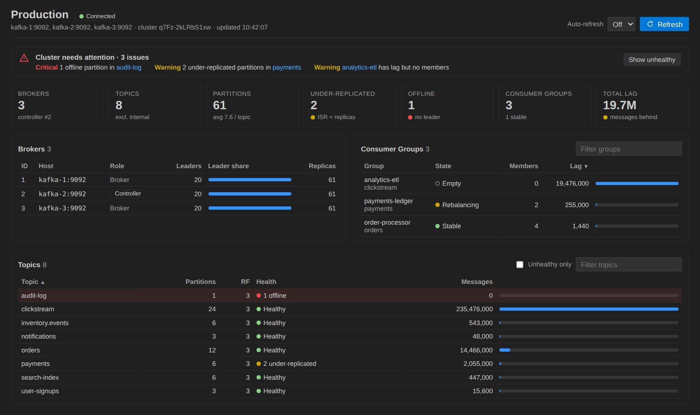
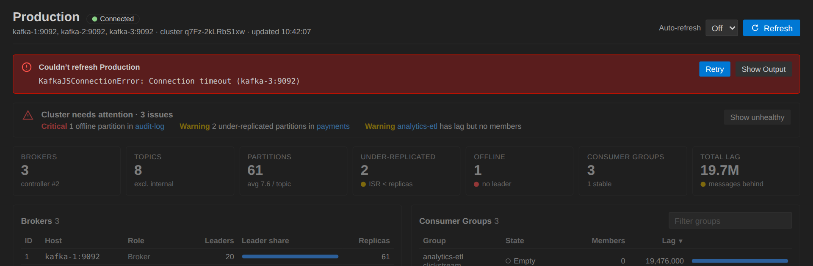
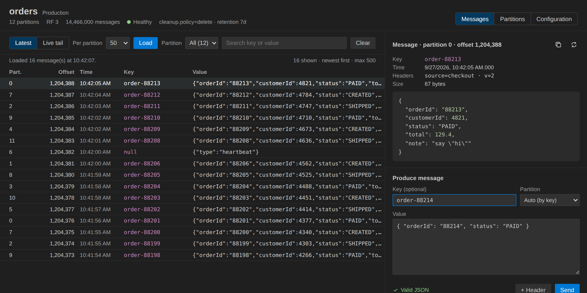
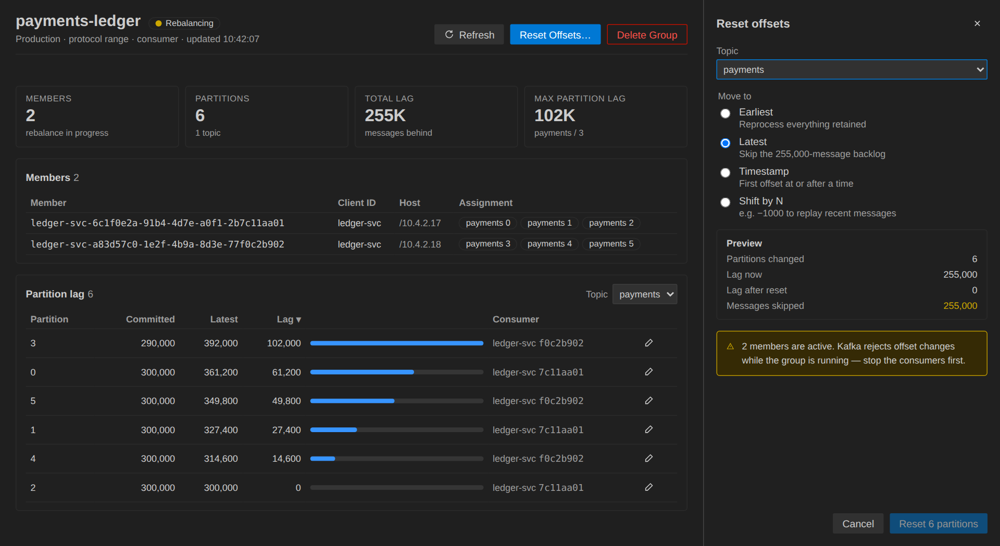

# vscode-kafka

Manage Apache Kafka clusters directly from VS Code: connect to one or more clusters, browse topics and partitions, inspect consumer groups and their lag, produce messages, and tail live traffic — all from a sidebar tree and a message-browser panel.

## Features

- **Cluster dashboard** — click the dashboard icon on a connected cluster (or run **Kafka: Open Cluster Dashboard**, or click the Kafka item in the status bar) for a one-page health view: an issues banner with links to the affected topics and groups, broker/topic/partition/group counts, under-replicated and offline partitions, total consumer lag, per-broker leader distribution, and sortable, filterable topic and consumer-group tables. Optional auto-refresh every 10/30/60 seconds; if refreshes keep failing, the last good data stays on screen, marked stale.
- **Cluster explorer** — a "Kafka" activity bar view lists your configured clusters with their connection state. Topics show a green/yellow/red health dot with details on hover. The cluster context menu can open the dashboard, create a topic, copy the bootstrap servers, rename or remove the cluster.
- **Guided setup** — a welcome view on first run, and a two-step **Add Cluster** input that checks every broker is `host:port` and connects right away.
- **Topic panel** — click a topic for three tabs. **Messages**: load the newest messages per partition or live-tail new ones (with pause), filter by partition or search key/value, and inspect a message's key, headers and pretty-printed JSON. **Partitions**: leader, replicas, ISR, health and offsets per partition. **Configuration**: overridden settings, with defaults on request.
- **Produce** — send a message with an optional key, target partition and headers; JSON values are checked as you type (Ctrl/Cmd+Enter sends).
- **Consumer group panel** — state, members with their assigned partitions, and lag per partition. **Reset Offsets…** moves a topic to earliest, latest, a timestamp, or shifts by N, with a preview of partitions changed and messages skipped or replayed; it's blocked while the group has active members.
- **Topic management** — create and delete topics from the tree's context menu.

## Screenshots

### Cluster dashboard

Health at a glance: open issues with links to the affected topics and groups, summary tiles, broker leadership, consumer-group lag and topic sizes.

When a refresh fails, the last good data stays on screen, marked stale, with Retry and Show Output.

### Topic panel

Browse the newest messages or live-tail new ones, inspect a message's key, headers and JSON value, and produce messages with a key, partition and headers.

### Consumer group panel

Members and their assigned partitions, lag per partition, and a Reset Offsets panel that previews the change before applying it.

## Requirements

Network access to your Kafka broker(s). No local Kafka installation is required by the extension itself — it talks to brokers over the wire via [KafkaJS](https://kafka.js.org/).

## Getting started

1. Open the Kafka view in the activity bar.
2. Click **Add Cluster** (`+`) and enter a name and comma-separated broker list, e.g. `localhost:9092`.
3. The cluster connects straight away; use the connect icon to reconnect later.
4. Click the dashboard icon for a health overview, expand **Topics** or **Consumer Groups** to browse, or click a topic to open its panel.

## Extension Settings

* `kafka.clusters`: array of `{ id, name, brokers }` entries. Normally managed via the **Kafka: Add Cluster** / **Kafka: Remove Cluster** commands, but can be hand-edited in `settings.json`.

## Known Issues

- Authenticated clusters (SASL/SSL) are not yet supported — only plaintext broker connections.
- The message browser's "Load Recent" reads from the end of each partition using a throwaway consumer group, so it never affects real consumer group offsets, but very large messages or very high-throughput topics may take a moment to load.

## Release Notes

See [CHANGELOG.md](CHANGELOG.md) for the full history.

### 0.1.0

- **New: Cluster dashboard** — health tiles, an issues banner, broker leader distribution, topic sizes and consumer-group lag in one panel, with filtering, sorting, auto-refresh, and click-through to topic and group panels. Failed refreshes keep the last good data on screen, marked stale.
- **New: Status bar item** showing connected clusters and open issues.
- **Explorer** — welcome view, topic health dots and tooltips, last connection error on the cluster, and Copy Bootstrap Servers, Rename and Create Topic in the cluster menu. Add Cluster now validates `host:port` and connects immediately.
- **Topic panel redesign** — Messages / Partitions / Configuration tabs, live tail with pause, partition filter and search, message detail with headers and highlighted JSON, and produce with partition and headers.
- **Consumer group panel redesign** — members with assignments, per-partition lag, and Reset Offsets (earliest, latest, timestamp, shift by N) with a preview.
- **Fixes** — Rename Cluster always failing, Create Topic reporting success for an existing topic, the admin client left open after a failed connection, and consumer group offsets not refreshing.

### 0.0.4

- CI/CD: tests on Linux, Windows and macOS, `.vsix` packaging, and Marketplace publishing on `v*` tags.
- Fixed the test build and the cluster name not updating after a rename.

### 0.0.1

Initial release: cluster explorer, topic/partition browsing, consumer group lag, message tailing and producing, topic create/delete.
